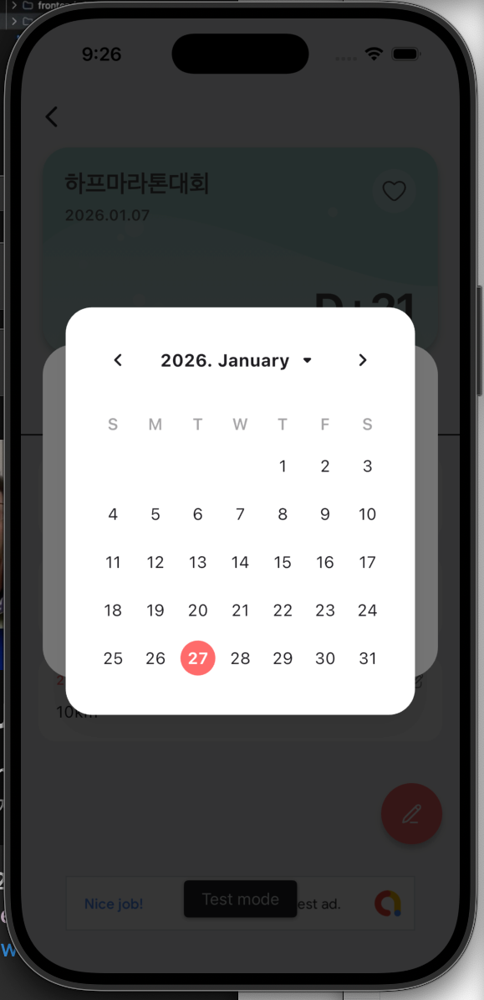

# 개선사항  v2

## poster-card 
- 이벤트 카드에 사용되는 텍스트의 컬러를 조정하고 싶어. 짙은 그레이 컬러로 통일해줘. 

## 메인화면
- 메인화면 상단에 Days+ 타이틀 위치를 좀 아래로 내리고 싶어. 

## 수정화면
1. 타이틀을 작성할때 카드에 실시간으로 반영이 안되네. 원래 됐었어. 반영되게 해줘.
2. 날짜를 변경할때도 실시간으로 반영되게 해줘.
3. 당일포함 / 주말제외 도 실시간으로 반영되게 해줘.
4. 당일포함 / 주말제외 항목 아래에 새로운 항목으로 알림을 on/off 하는 항목 추가해줘. 형태는 당일포함과 동일하게 해줘. 

## 한줄메모

1. 한줄메모에서 날짜 선택후 나오는 달력에서 메모가 있는 날을 표시하고 싶어. 
    날짜 아래에 점을 찍으면 좋겠어. or 날짜 배경을 살짝 진하게 해도 좋아.