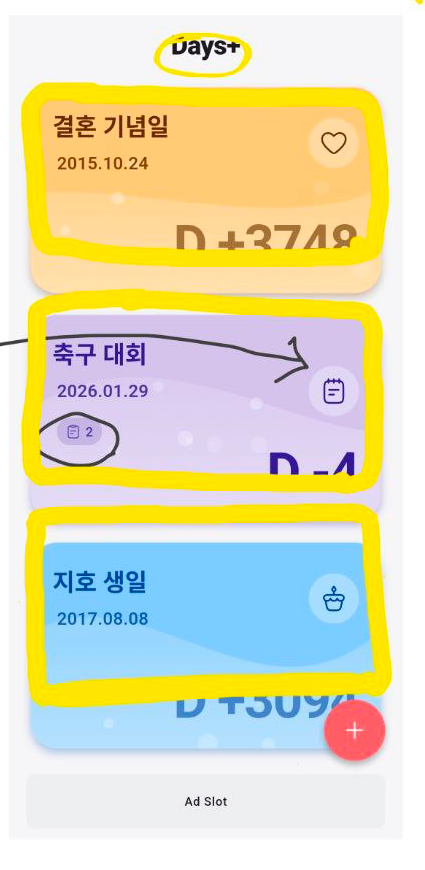

# 레이아웃 v2

## 이미지를 보면서 설명할게 1. 

1. [x] 타이틀과 날짜의 좌측 정렬을 맞춰줘. 
2. [x] 카운트된 D+days 와 +버튼이 겹쳐지고 있어. +버튼의 크키를 조금 줄여줘. 

## 이미지를 보면서 설명할게 2. 

1. [x] 할일 표시마크도 좌측 정렬을 맞춰줘. 
2. [x] 우측 아이콘의 위치가 너무 내려갔어. 위치를 타이틀과 맞춰줘. 할일 마크가 추가 되면 아이콘의 위치가 변경되고 있어. 움직이지 않게 체크해줘. 
3. [x] 이벤트카드의 크기를 조절해줘. 높이를 조금만 줄여줘. 내가 그려놓은 노란색라인 박스 크기정도로 줄여줘. 

