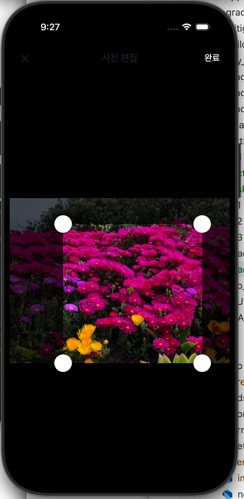
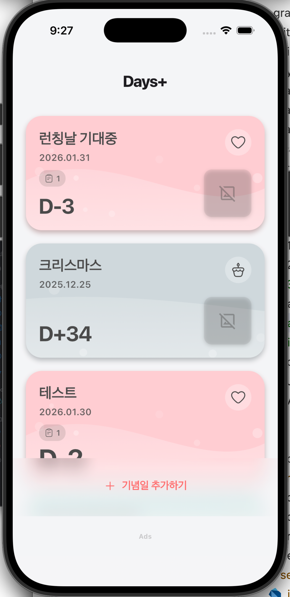
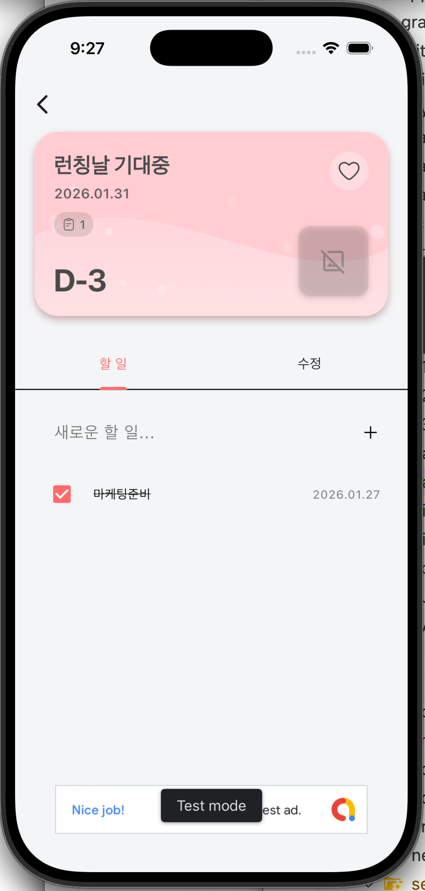
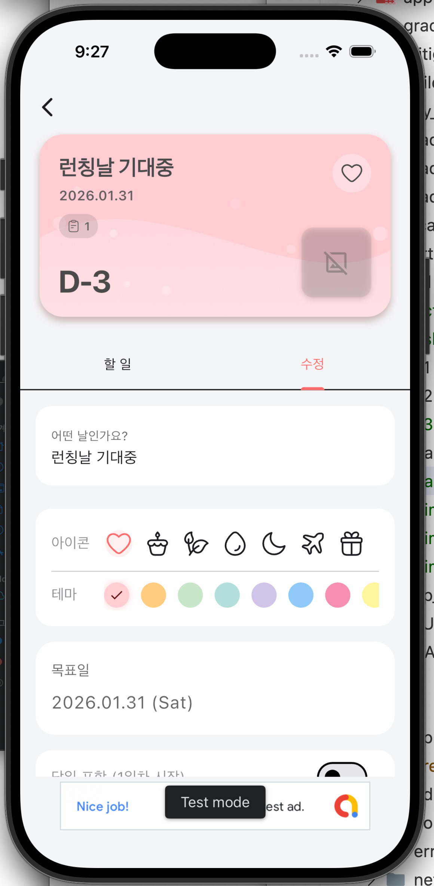
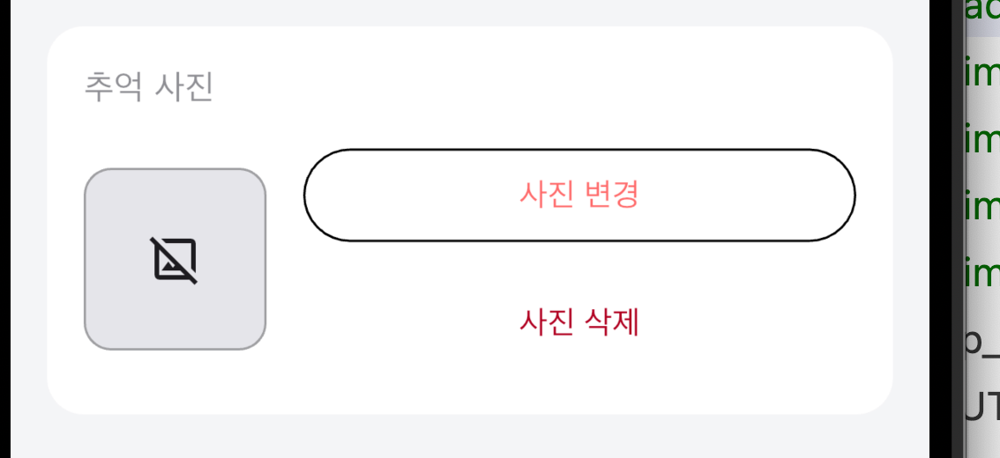
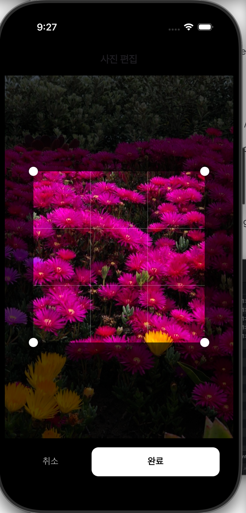
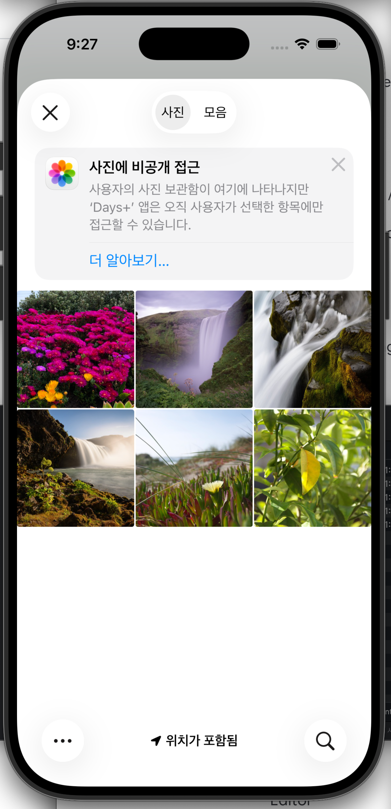
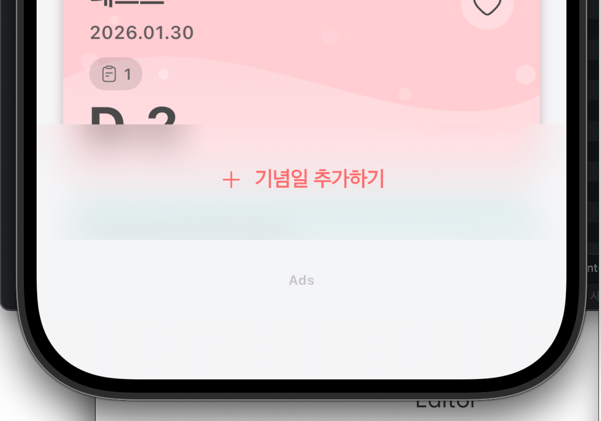

# 개선사항

1. 흰색 크롭 핸들 UI의 터치영역은 지금 그대로 두고. 보여지는 크기만 50% 줄여줘. 

2.

이 화면에서 취소 버튼도 넣어주고. 
취소, 완료 둘다 하단에 배치해줘. 

3.
  
사진이 없을경우에 나오는 저 표시는 빼줘. 너무 촌스러워. 사진등록하지 않은상태랑 동일하게 해줘. 

4.

이 화면에서 UI/UX 개선이 필요해.  더 간단한 UX 를 구현해줘. 

# 개선사항 2

1.  이 사진 편집 화면에서 취소 버튼을 누르면

이 상태로 돌아오도록 수정해줘. 

2. 

기념일 추가하기 의 영역이 크기가 너무커.  너무 높이가 높아. 줄여줘. 
글래스모피즘  빼주고, 탑바 영역처럼 동일하게 해줘. 

3. 탑바 영역도 크기가 커. 높이가 높아. 줄여줘. 