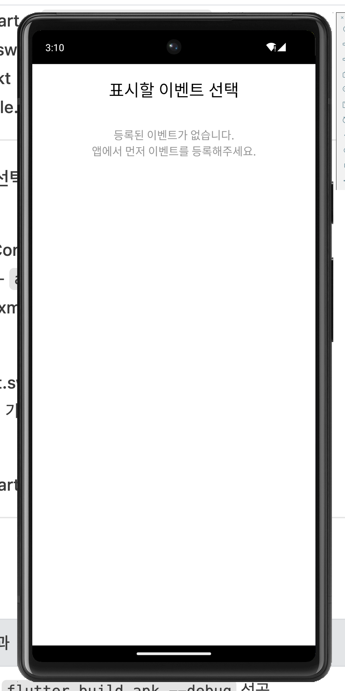
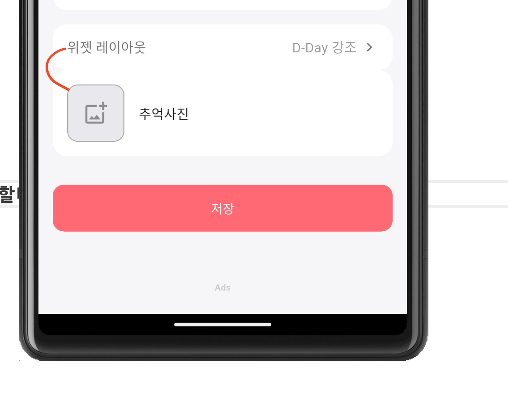

# 개선사항

## 안드로이드 위젯
안드로이드 위젯의 크기가 작아지면 타이틀과 dday가 겹쳐서 보이고 있어. 크기별로 폰트를 줄여서 겹치지 않게 해줘.

## 위젯의 레이아웃 선택 기능
위젯에서 레이아웃을 선택할 수 있게 해줘. 위젯에 표시하는 정보는 타이틀, 목표일, dday 3가지야. 
레이아웃은 2가지로 해줘.
1. dday를 크게 표시하는 레이아웃 (목표일은 타이틀 아래에 작게 표시하고, 항상 타이틀아래에 있어야돼)
2. 타이틀을 크게 표시하는 레이아웃
3. 위젯의 레이아웃을 선택하는 UI는 새이벤트등록, 수정 화면에 버튼으로 추가해주고, 버튼을 누르면 팝업으로 레이아웃을 선택할 수 있게 해줘.

## 위젯으로 등록할 이벤트 선택기능
위젯을 설치할때 어떤 이벤트를 위젯에 표시할지 선택할 수 있게 해줘. 

한줄메모 제스쳐로 삭제할때 컬러, 할일 삭제할때 컬러와 동일하게 해줘.

위젯이 나오지 않아. ios, android 모두 확인해줘. 

다른항목처럼 간격을 유지해줘. 